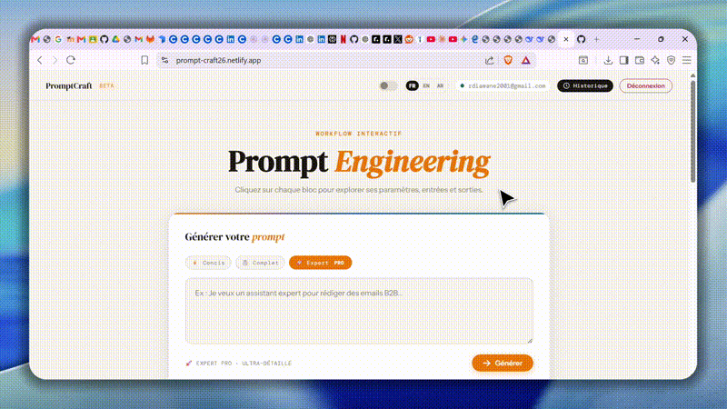
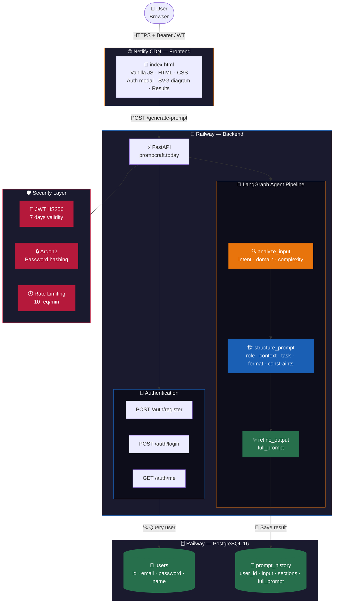

<div align="center">


<br/>

[](https://fastapi.tiangolo.com)
[](https://langchain-ai.github.io/langgraph/)
[](https://groq.com)
[](https://python.org)
[](https://postgresql.org)
[](https://docker.com)
[](LICENSE)

<br/>

> **PromptCraft transforms your raw ideas into structured, production-ready prompts**
> using a 3-node LangGraph agent pipeline — analyze → structure → refine.
>
> 🎯 Stop wasting time rewriting prompts. Get perfect results on the first try.

<br/>

**Author:** DIAWANE Ramatoulaye &nbsp;·&nbsp;
[Report Bug](../../issues) &nbsp;·&nbsp;
[Request Feature](../../issues) &nbsp;·&nbsp;
[API Docs](https://promptcraft.today/docs)

</div>

---

## 📑 Table of Contents

- [✨ Why PromptCraft ?](#-why-promptcraft-)
- [🎬 Demo](#-demo)
- [🏗️ Architecture](#-architecture)
- [📁 Project Structure](#-project-structure)
- [⚙️ Prerequisites](#-prerequisites)
- [🚀 Getting Started](#-getting-started)
- [🐳 Docker](#-docker)
- [🔐 Environment Variables](#-environment-variables)
- [📡 API Reference](#-api-reference)
- [🤖 Agent Pipeline](#-agent-pipeline)
- [🔑 Authentication & Security](#-authentication--security)
- [🖥️ Frontend](#-frontend)
- [🤝 Contributing](#-contributing)
- [🗺️ Roadmap](#-roadmap)

---

## ✨ Why PromptCraft ?

Most people use AI like this :

```
❌ "Write me an email"       →  mediocre result
❌ "Help me with my code"    →  vague answer
❌ "Summarize this"          →  generic output
```

PromptCraft structures your request into a professional prompt :

```
✅ Role        →  who the AI should be
✅ Context     →  background information
✅ Task        →  precise step-by-step instructions
✅ Format      →  expected output structure
✅ Constraints →  what to avoid
```

**Result : production-ready prompts in 3 seconds. Every time.**

---

## 🎬 Demo

| Step | Action | Result |
|------|--------|--------|
| 1️⃣ | Type your idea in plain language | *"I need an assistant to debug Python code"* |
| 2️⃣ | Agent analyzes your request | intent · domain · complexity detected |
| 3️⃣ | Agent structures 5 sections | role · context · task · format · constraints |
| 4️⃣ | Agent refines into final prompt | fluent, professional, ready to use |
| 5️⃣ | Copy & paste into any AI | ChatGPT · Claude · Gemini · Mistral |

🌍 **Try it live :** 


---

## 🏗️ Architecture



---

## 📁 Project Structure

```
promptcraft/
│
├── 📂 backend/
│   ├── 📂 agent/
│   │   ├── __init__.py
│   │   ├── graph.py          # LangGraph graph — 3 nodes pipeline
│   │   ├── nodes.py          # analyze_input · structure_prompt · refine_output
│   │   ├── router.py         # FastAPI router for agent endpoints
│   │   └── state.py          # AgentState TypedDict
│   │
│   ├── 📂 auth/
│   │   ├── __init__.py
│   │   └── router.py         # JWT auth — register · login · me
│   │                         # Argon2 password hashing
│   │
│   ├── 📂 models/
│   │   ├── __init__.py
│   │   └── schemas.py        # SQLAlchemy models — User · PromptHistory
│   │
│   ├── 📂 db/
│   │   └── database.py       # PostgreSQL connection — SQLAlchemy engine
│   │
│   └── main.py               # FastAPI app — CORS · Rate limiting · Routes
│
├── 📂 front/
│   ├── index.html            # Single-page app — no build step needed
│   └── vercel.json           # Netlify/Vercel static config
│
├── 🐳 Dockerfile             # Backend container — python:3.12-slim
├── 🐳 docker-compose.yml     # Full stack — backend · db · frontend (nginx)
├── 🐳 nginx.conf             # Nginx config for frontend serving
├── 🐳 .dockerignore          # Docker build exclusions
│
├── .env                      # ⚠️ Never commit — local secrets
├── .env.example              # Template for contributors
├── .gitignore
├── pyproject.toml            # uv project config + pinned dependencies
├── uv.lock                   # Locked dependency versions
└── README.md
```

---

## ⚙️ Prerequisites

| Tool | Min Version | Install |
|------|-------------|---------|
| 🐍 Python | `3.12` | [python.org](https://python.org) |
| 📦 uv | `latest` | `curl -Ls https://astral.sh/uv/install.sh \| sh` |
| 🐘 PostgreSQL | `16` | `sudo apt install postgresql` |
| 🐳 Docker | `24+` | [docs.docker.com](https://docs.docker.com/get-docker/) |
| 🔑 Groq API Key | — | [console.groq.com](https://console.groq.com) |

---

## 🚀 Getting Started

### 1 · Clone

```bash
git clone https://github.com/Ramadiaw12/generate_prompt.git
cd generate_prompt
```

### 2 · Install dependencies

```bash
uv sync
```

> All dependencies are pinned in `uv.lock`. **Never use `pip install` directly.**

### 3 · Configure environment

```bash
cp .env.example .env
# Fill in your values
```

### 4 · Setup PostgreSQL

```bash
sudo -u postgres psql
```

```sql
CREATE DATABASE promptcraft;
CREATE USER promptuser WITH PASSWORD 'yourpassword';
GRANT ALL PRIVILEGES ON DATABASE promptcraft TO promptuser;
ALTER SCHEMA public OWNER TO promptuser;
\q
```

### 5 · Start the backend

```bash
cd backend
uv run uvicorn main:app --reload --port 8000
```

✅ API running at `http://localhost:8000`
📖 Swagger UI at `http://localhost:8000/docs`

You should see :
```
✅ Tables PostgreSQL créées / vérifiées.
✅ Agent graph compilé et prêt.
INFO: Application startup complete.
```

### 6 · Start the frontend

```bash
cd front
python -m http.server 3000
```

🌐 Open `http://localhost:3000`

---

## 🐳 Docker

Run the entire stack with a single command :

```bash
# Start everything
docker compose up --build -d

# Check status
docker compose ps

# View logs
docker compose logs -f backend

# Stop everything
docker compose down
```

**Services launched :**

| Service | URL | Description |
|---------|-----|-------------|
| 🚀 Backend | `http://localhost:8000` | FastAPI + LangGraph |
| 🌐 Frontend | `http://localhost:3000` | Nginx + HTML |
| 🗄️ Database | `localhost:5433` | PostgreSQL 16 |

---

## 🔐 Environment Variables

```bash
# .env.example

#  PostgreSQL 
POSTGRES_DB=....
POSTGRES_USER=....
POSTGRES_PASSWORD=yourstrongpassword

# Local without Docker
DATABASE_URL=....localhost/promptcraft
# With Docker ("db" = Docker service name)

# ── JWT 
# Generate with: openssl rand -hex 32
SECRET_KEY=your-secret-key-here

#  Groq API 
GROQ_API_KEY=gsk_...
```

> ⚠️ `.env` is already in `.gitignore`. **Never expose your API keys publicly.**

---

## 📡 API Reference

### 🔓 Auth endpoints

| Method | Endpoint | Auth | Description |
|--------|----------|:----:|-------------|
| `POST` | `/auth/register` | ❌ | Create a new account |
| `POST` | `/auth/login` | ❌ | Login — returns JWT (7 days) |
| `GET` | `/auth/me` | ✅ | Get current user info |

<details>
<summary><b>POST /auth/register</b></summary>

```jsonc
// Request
{
  "email": "user@example.com",
  "password": "mypassword",
  "name": "Ramatoulaye"
}

// Response 201
{
  "message": "Compte créé avec succès.",
  "email": "user@example.com",
  "id": 1
}
```
</details>

<details>
<summary><b>POST /auth/login</b></summary>

```
Content-Type: application/x-www-form-urlencoded
username=user@example.com&password=mypassword
```

```jsonc
// Response 200
{
  "access_token": "eyJhbGciOiJIUzI1NiIsInR5cCI6IkpXVCJ9...",
  "token_type": "bearer"
}
```
</details>

---

### 🔒 Protected endpoints

| Method | Endpoint | Auth | Rate Limit | Description |
|--------|----------|:----:|------------|-------------|
| `POST` | `/generate-prompt` | ✅ | 10/min | Run the agent pipeline |
| `GET` | `/my-prompts` | ✅ | 20/min | Get prompt history |
| `GET` | `/health` | ❌ | 30/min | Server health check |

<details>
<summary><b>POST /generate-prompt</b></summary>

```jsonc
// Request
{
  "user_input": "I need an assistant to debug Python code"
}

// Response 200
{
  "intent":        "Create a Python debugging assistant",
  "domain":        "code",
  "complexity":    "medium",
  "role":          "You are an expert Python developer with 10+ years...",
  "context":       "The user needs help identifying and fixing bugs...",
  "task":          "1. Analyze the code provided\n2. Identify the bug...",
  "output_format": "Structured response with: bug location, explanation...",
  "constraints":   "Focus on Python best practices, explain clearly...",
  "full_prompt":   "You are an expert Python developer..."
}
```
</details>

---

## 🤖 Agent Pipeline

The pipeline is a **deterministic LangGraph graph** — 3 sequential nodes, no cycles, predictable latency (~3 seconds).

```
  user_input
      │
      ▼
┌─────────────────────────────────┐
│         analyze_input           │
│  model : LLaMA 3.3 70B (Groq)  │
│  output: intent                 │
│          domain                 │
│          complexity             │
└──────────────┬──────────────────┘
               │
               ▼
┌─────────────────────────────────┐
│       structure_prompt          │
│  model : LLaMA 3.3 70B (Groq)  │
│  output: role                   │
│          context                │
│          task                   │
│          output_format          │
│          constraints            │
└──────────────┬──────────────────┘
               │
               ▼
┌─────────────────────────────────┐
│         refine_output           │
│  model : LLaMA 3.3 70B (Groq)  │
│  output: full_prompt            │
│          (fluent · professional │
│           · ready to use)       │
└─────────────────────────────────┘
               │
               ▼
    💾 Saved to PostgreSQL
    📤 Returned to frontend
```

Each node is a **pure function** `(AgentState) -> AgentState`.
Errors are caught per-node and short-circuit the pipeline gracefully.

### Adding a new node

```python
# 1. backend/agent/nodes.py
def my_new_node(state: AgentState) -> AgentState:
    if state.get("error"):
        return state
    # ... call LLM ...
    return {**state, "my_new_field": result}

# 2. backend/agent/state.py — add key to AgentState
# 3. backend/agent/graph.py — wire the node
# 4. backend/main.py       — expose in PromptResponse
# 5. front/index.html      — display the new field
```

---

## 🔑 Authentication & Security

| Feature | Implementation |
|---------|---------------|
| Password hashing | **Argon2** (`argon2-cffi`) — winner of PHC 2015 |
| Token signing | **JWT HS256** — valid 7 days |
| Rate limiting | **slowapi** — 10 req/min on generate, 30 req/min on public routes |
| CORS | Restricted to known frontend domains |
| SQL injection | Prevented by SQLAlchemy ORM |
| Secrets | Environment variables — never in code |

---

## 🖥️ Frontend

Single `index.html` — **no build step, no framework, no bundler.**

| Feature | Detail |
|---------|--------|
| 🗺️ Interactive SVG diagram | Clickable nodes explaining prompt engineering concepts |
| 🔐 Auth modal | Login / Register with JWT stored in localStorage |
| ⚡ Generation form | Textarea → API → 5-section results + full prompt |
| 📋 Copy to clipboard | One-click copy of the generated prompt |
| ⌨️ Keyboard shortcut | `Ctrl+Enter` / `Cmd+Enter` to submit |
| 📱 Responsive | Works on mobile and desktop |
| 🎨 Design system | CSS custom properties · DM Serif Display · DM Mono |

---

## 🌍 Deployment

| Service | Platform | URL |
|---------|----------|-----|
| 🚀 Backend | Railway | [promptcraft.today](https://promptcraft.today) |
| 🌐 Frontend | Netlify | [prompt-craft26.netlify.app](https://prompt-craft26.netlify.app) |
| 🗄️ Database | Railway PostgreSQL | Private |

---

## 🤝 Contributing

Contributions are welcome ! Please follow these steps :

```bash
# 1. Fork and clone
git clone https://github.com/Ramadiaw12/generate_prompt.git

# 2. Create a feature branch
git checkout -b feat/your-feature-name

# 3. Install dependencies
uv sync

# 4. Make your changes and test locally

# 5. Commit with Conventional Commits
git commit -m "feat(agent): add memory node to graph"

# 6. Push and open a Pull Request
git push origin feat/your-feature-name
```

### Commit Convention

| Prefix | When to use |
|--------|-------------|
| `feat` | New feature |
| `fix` | Bug fix |
| `refactor` | Restructure without behavior change |
| `docs` | Documentation only |
| `test` | Adding or updating tests |
| `chore` | Tooling, deps, config |

### Code Rules

- ✅ Type hints on every function
- ✅ Docstring on every node and route
- ✅ Keep nodes **pure** — no side effects outside `AgentState`
- ❌ Never commit `.env` or API keys
- ❌ Never use `pip install` — always `uv add`

---

## 🗺️ Roadmap

| Status | Feature |
|--------|---------|
| ✅ | **FastAPI Backend** — REST API with JWT auth |
| ✅ | **LangGraph Agent** — 3-node pipeline |
| ✅ | **PostgreSQL** — persistent users + prompt history |
| ✅ | **Docker** — full containerized stack |
| ✅ | **Rate Limiting** — brute force protection |
| ✅ | **Production Deploy** — Railway + Netlify |
| ✅ | **Custom Domain** — promptcraft.today |
| 🔲 | **Stripe Payments** — Free · Pro · Team plans |
| 🔲 | **Prompt History UI** — view past generations in frontend |
| 🔲 | **Streaming** — token-by-token response via SSE |
| 🔲 | **Export** — download prompt as `.txt` or `.md` |
| 🔲 | **Multi-model** — GPT-4o · Claude · Mistral selector |
| 🔲 | **Tests** — pytest suite for all nodes and routes |
| 🔲 | **Analytics** — usage dashboard per user |

---

<div align="center">

### 🌍 Try PromptCraft now

**[promptcraft.today](https://prompt-craft26.netlify.app/)**

*Transform your ideas into perfect prompts in 3 seconds.*

<br/>

Made with 🧠 ☕ and a lot of debugging by

**DIAWANE Ramatoulaye**

[](https://github.com/Ramadiaw12)
[](https://linkedin.com/in/votre-profil)
[](https://twitter.com/votre-compte)

<br/>

*Pull requests are welcome. For major changes, please open an issue first.*

⭐ **Star this repo if PromptCraft helped you !**

</div>